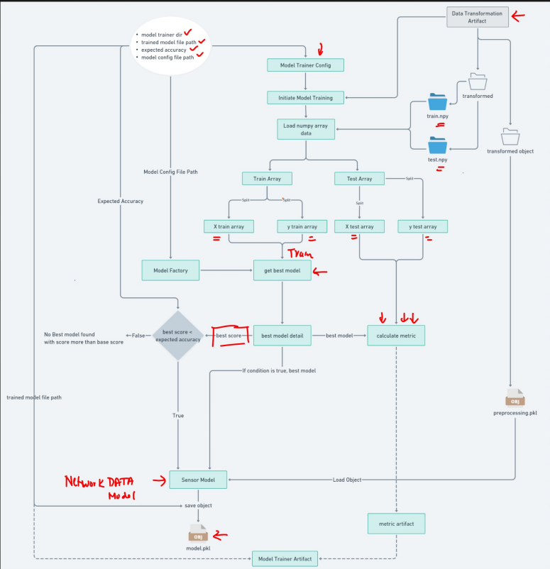

# Complete MLOps Project

## 1. Complete Architecture of MLOps

## 2. Complete Data Ingetion of MLOps

## 3. Complete Data Validation of MLOps

## 4. Complete Data Transformation of MLOps

## 5. Complete Model Training of MLOps

# How the Run

1. Create the python environment:
    
        python3 -m venv myenv

2. Install all packages:

        pip install -r requirements.txt

3. Run the application:

        python3 app.py

4. Check the url port and redirect to:

        /docs

5. Run the training API and check the final_model folder whether the model is created and check log folder

6. Run the predict API choosing the trained model from final_model

7. (optional) You can also run via Docker by building it